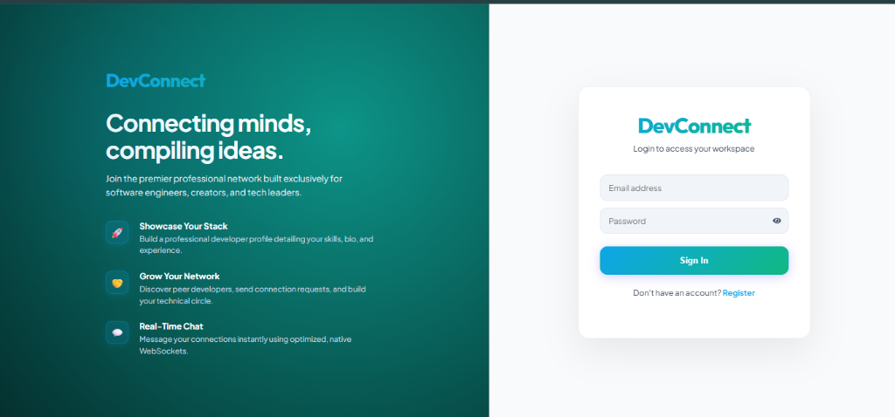
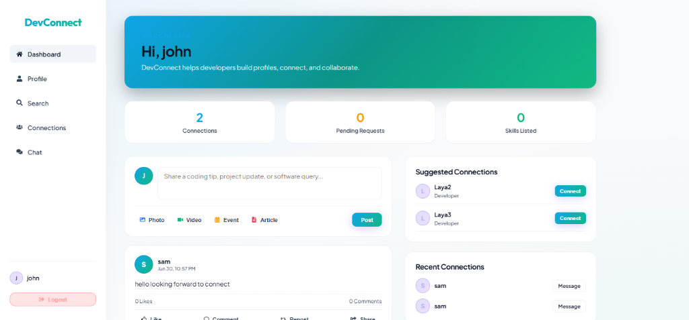
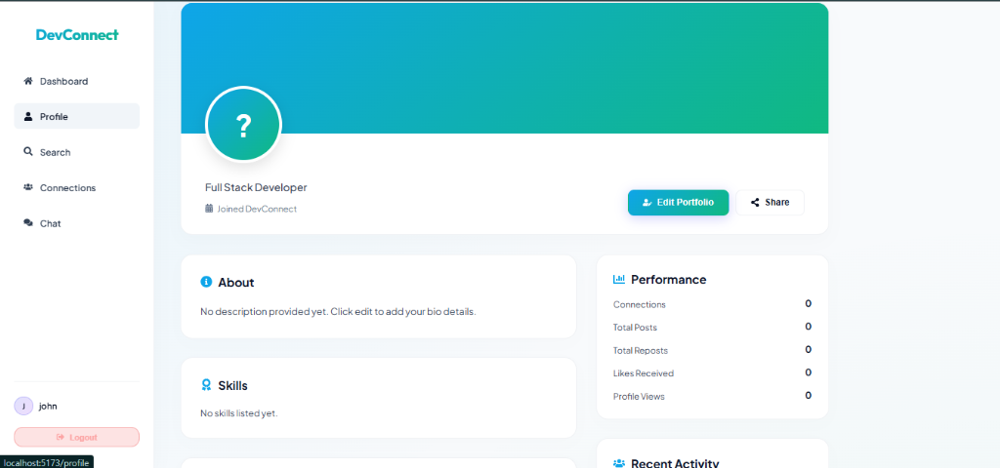
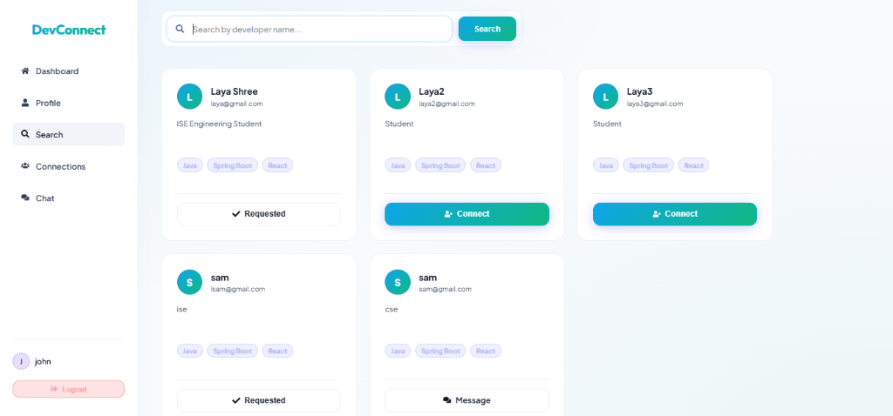
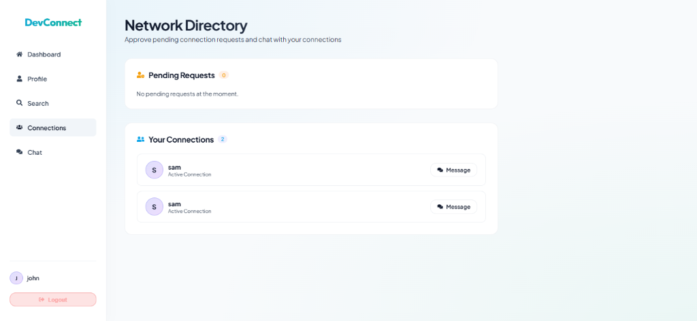
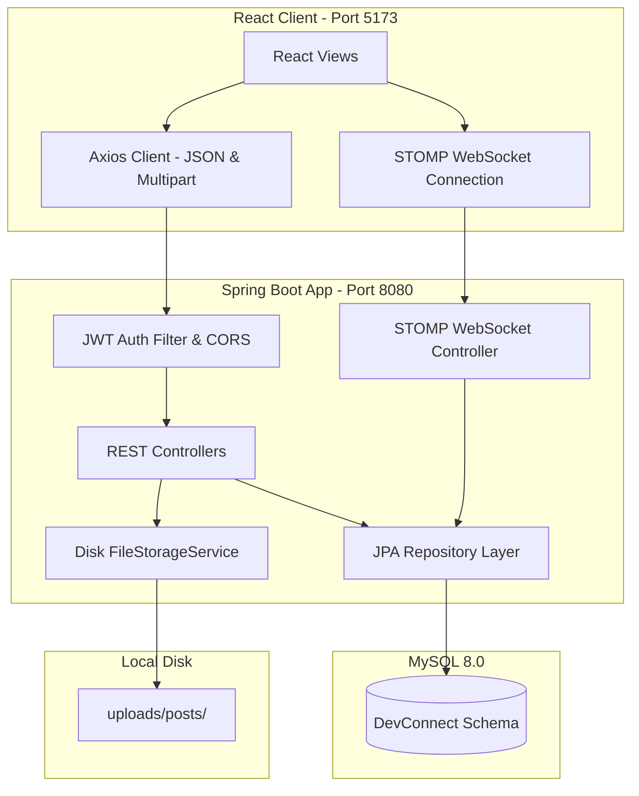
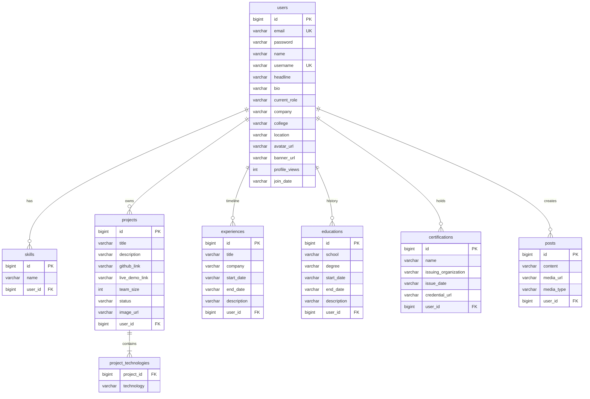

# 🚀 DevConnect - The Premium Developer Portfolio & Collaboration Network

DevConnect is a premium, production-ready professional network designed exclusively for software developers. Think of it as a combination of GitHub and LinkedIn: developers can build stunning, comprehensive portfolios (showcasing skills, certifications, experience, education, and projects with live demo links), share coding tips, publish media-attached posts, connect with peers, and collaborate via secure, real-time WebSocket chats.

---

## 🎨 Design Aesthetics & User Experience
DevConnect features a curated slate-light theme with beautiful gradients, sleek layouts, responsive mobile-friendly designs, stateful loading shimmer skeletons, and smooth user transitions. 

* **No Commas, No Plain Strings**: Developer attributes are structured relationally in the MySQL database.
* **Modern Badges**: Technologies and skills are rendered as colorful, curated badges.
* **Navigation Badges**: Sidebar menus dynamically poll and present unread message indicators and pending connection request counts.

---

## 📷 Screenshots

### Login Page


### Dashboard Feed & Composer


### Developer Portfolio Profile


### Search & Discovery Directory


### Connections Network Management


---

## 🛠️ Tech Stack

### Frontend
* **Core**: React 19, JavaScript (ES6+), HTML5, CSS3 variables
* **Styling**: Curated Light Theme CSS with HSL variables (no Tailwind overhead)
* **Build Tool**: Vite 8
* **Routing**: React Router DOM v7
* **API Client**: Axios with interceptors
* **Messaging**: STOMP over WebSockets (`@stomp/stompjs`)

### Backend
* **Core**: Java 17, Spring Boot 3.5.15
* **Security**: Spring Security (Stateless JWT token verification, BCrypt password hashing)
* **Database Access**: Spring Data JPA & Hibernate
* **Database**: MySQL 8
* **Messaging**: Spring WebSocket Broker & STOMP

---

## 🏢 System Architecture



---

## 🗄️ Relational Database Schema

DevConnect uses an optimized relational database schema instead of unstructured JSON blobs.



---

## 📁 Folder Structure

```
devconnect/
├── backend/
│   ├── src/main/java/com/devconnect/backend/
│   │   ├── chat/          # Real-time WebSocket controllers & messaging models
│   │   ├── config/        # CORS, Web static resources, WebSocket, & Security filters
│   │   ├── connection/    # Peer request/response, repository, and controller mappings
│   │   ├── dto/           # Login and Connection payload data transfer transfer entities
│   │   ├── entity/        # Relational models (Skill, Project, Experience, etc.)
│   │   ├── exception/     # Global REST exception handlers
│   │   ├── jwt/           # JWT parsing, signing, and verification utilities
│   │   ├── post/          # Feed management & post CRUD operations
│   │   ├── profile/       # Profile backfilling & view counts
│   │   └── service/       # Business logic (UserService & FileStorageService)
│   ├── src/main/resources/application.properties
│   └── pom.xml
├── frontend/
│   ├── public/            # Static assets
│   ├── src/
│   │   ├── api/           # Base Axios client configurations
│   │   ├── assets/        # Visual banners and icons
│   │   ├── components/    # Reusable widgets (Navbar, Badge, ProtectedRoute)
│   │   ├── context/       # Auth state management
│   │   ├── pages/         # Core views (Login, Profile, chat, Dashboard)
│   │   └── index.css      # Core Design System Stylesheet
│   ├── package.json
│   └── vite.config.js
└── README.md
```

---

## ⚙️ Environment Variables

### Backend (`backend/src/main/resources/application.properties`)
```properties
spring.application.name=backend
spring.datasource.url=jdbc:mysql://localhost:3306/devconnect?createDatabaseIfNotExist=true
spring.datasource.username=root
spring.datasource.password=YOUR_MYSQL_PASSWORD
spring.datasource.driver-class-name=com.mysql.cj.jdbc.Driver

# JPA Config
spring.jpa.hibernate.ddl-auto=update
spring.jpa.show-sql=true
spring.jpa.properties.hibernate.dialect=org.hibernate.dialect.MySQLDialect

# Multipart file sizes
spring.servlet.multipart.max-file-size=5MB
spring.servlet.multipart.max-request-size=5MB
```

### Frontend (`frontend/src/api/api.js`)
Configured to point dynamically to your Spring Boot API:
```javascript
const API_URL = "http://localhost:8080";
```

---

## 🚀 Installation & Running Locally

### Prerequisites
* Java 17 JDK
* Node.js (v18+) & npm
* MySQL Server (v8.0+)

### 1. Database Setup
Ensure MySQL is running on your local machine, and create the schema:
```sql
CREATE DATABASE devconnect;
```

### 2. Startup Backend
Navigate to the `backend/` directory, configure your database credentials in `application.properties`, and run:
```bash
# Windows
.\mvnw.cmd spring-boot:run

# macOS / Linux
chmod +x mvnw
./mvnw spring-boot:run
```
The backend API starts on `http://localhost:8080`.

### 3. Startup Frontend
Navigate to the `frontend/` directory, install packages, and launch:
```bash
npm install
npm run dev
```
The client app opens in your browser at `http://localhost:5173`.

---

## 📡 API Overview

### Authentication
* `POST /api/users/register` - Create a new developer account.
* `POST /api/users/login` - Authenticate and retrieve a JWT token.

### Developer Profile
* `GET /api/profile/{userId}` - Fetch user details, view counts, and relational child entities.
* `PUT /api/profile/update` - Save edits to banners, profile pictures, and core developer information.
* `POST /api/profile/skills` / `DELETE /api/profile/skills/{id}` - Manage relational skills.
* `POST /api/profile/projects` / `DELETE /api/profile/projects/{id}` - Manage projects.

### Connections
* `POST /api/connections/send` - Send a peer connection request.
* `GET /api/connections/pending/{userId}` - Retrieve incoming connection requests.
* `PUT /api/connections/accept/{requestId}` - Accept a connection request.
* `GET /api/connections/accepted/{userId}` - Retrieve list of accepted connections.

### Feed & Media Uploads
* `GET /api/posts` - Fetch feed posts.
* `POST /api/posts/create` - Create a new post.
* `POST /api/posts/upload` - Secure file upload endpoint (validates mime-types, size limits to 5 MB, outputs secure UUID name).
* `DELETE /api/posts/{id}` - Delete post (triggers local filesystem cleanup).

---

## 🔮 Future Enhancements
- Integration with Amazon S3 or Cloudinary for cloud file attachments.
- GitHub API integration to automatically sync repositories directly into the Projects section.
- Video calling capability via WebRTC.
- Comprehensive unit and integration test suites.
